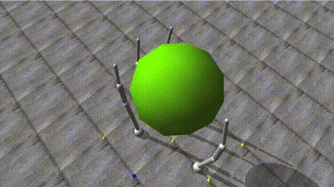
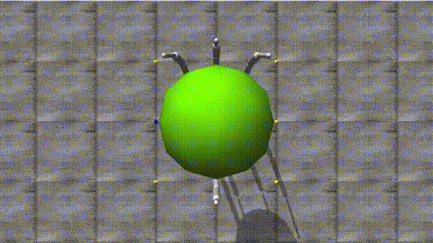

# Object Frame Impedance Control

My diploma thesis from ECE NTUA (2013) - finally rescued from a dusty hard drive after 13 years! 🎓

## What is this?

A MATLAB/Simulink implementation of **object-level impedance control** for a simulated 4-finger (16-DoF) robotic hand, using the ODE physics engine.

### Scope & attribution (read this first)

This project **implements and validates** a well-known object-level impedance control framework, primarily based on:

> **T. Wimböck, C. Ott, G. Hirzinger**  
> *"Passivity-based Object-Level Impedance Control for a Multifingered Hand"*  
> IEEE/RSJ International Conference on Intelligent Robots and Systems (IROS), 2006, pp. 4621-4627  
> [DOI: 10.1109/IROS.2006.282170](https://doi.org/10.1109/IROS.2006.282170)

The main value of this repo is therefore: **a complete, working simulation framework + full derivations + parameter justification + extensions**, rather than proposing a brand-new control concept.

### What I contributed (beyond implementing the paper)

- **Full mathematical analysis** of the control framework (the thesis is intentionally math-heavy)
- **Complete forward kinematics** for the 4-finger hand, including DH parameter identification
- **Symbolic dynamics derivation** for the fingers (Euler–Lagrange) using Mathematica/Robotica
- **Symbolic gravity compensation term** computed in Mathematica
- **Parameter justification**: why the stiffness choices are physically/control-wise reasonable (not just “picked values”)
- **Enhanced damping control law**, integrated from additional literature and made to work in this setting
- **End-to-end MATLAB/Simulink + ODE simulation implementation** (including all the plumbing needed to reproduce results)
- **Reproduction + validation** of the published behavior, plus additional evaluation plots
- **Extension of the contact force model**

## Demo

| Translation + Rotation | Force Response |
|:----------------------:|:--------------:|
|  |  |

## What's in here

- 📄 **[Thesis PDF](doc/dipl.-thesis/K.Vasios-ECE-Dipl.-Thesis.pdf)** - The full diploma thesis (in Greek)
- 📝 **[LaTeX source](doc/dipl.-thesis/latex/)** - If you want to compile it yourself
- 🔧 **[MATLAB/Simulink code](matlab/)** - The simulation implementation
- 🧮 **[Mathematica notebooks](mathematica/)** - Symbolic dynamics derivation using Robotica (inertia matrix, gravity terms, Jacobians)
- 🎬 **[Videos](media/)** - Simulation recordings

## TL;DR

The idea (from Wimböck et al.): instead of controlling each finger joint separately, control the *object's* position/orientation directly through impedance control. The controller makes the grasped object behave like a mass-spring-damper system in Cartesian space, with internal forces maintaining grasp stability.

## Building the thesis

```bash
cd doc/dipl.-thesis/latex
./compile.sh
```

Requires XeLaTeX + GFS Didot Greek fonts. See [thesis README](doc/dipl.-thesis/README.md) for details.

---

*Supervisor: Prof. Konstantinos Tzafestas, Signals Control & Robotics, ECE NTUA*
